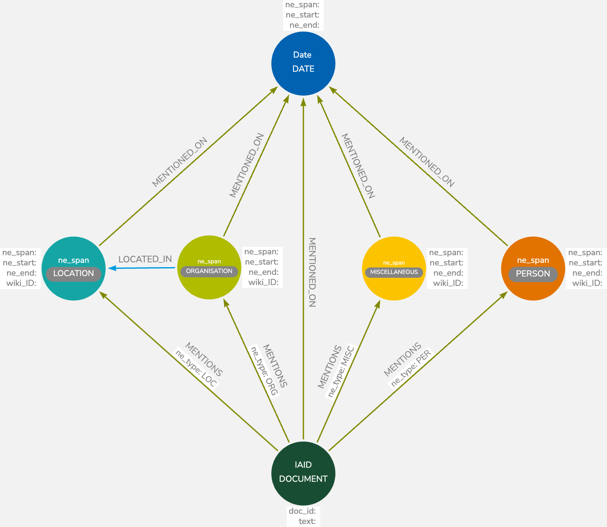

# Overview

The Search App provides a user interface to interact with a Neo4j database, enabling users to construct and execute Cypher queries for data retrieval.

# Data Model

The data model visualised as a graph is centred around the `DOCUMENT` node, represented by the IAID. Nodes in the graph are connected through various relationship types, such as `MENTIONS` and `LOCATED_IN`. The nodes and their relationships represent the extracted named entities and their contextual connections within the dataset.



## Explanation of the Data Model

The `DOCUMENT` node has properties such as `doc_id` and `text`, which contain the document's unique identifier and text content, respectively. The `DOCUMENT` node is connected to various entity nodes like `PERSON`, `ORGANISATION`, `LOCATION`, and `MISCELLANEOUS`, each with properties capturing the span, start, end, and optional Wiki ID from the named entity recognition (NER) process.


Nodes:
- `DOCUMENT`: Central node representing a document with a unique identifier.
- `PERSON`: Named entities recognised as people.
- `ORGANISATION`: Named entities recognised as organisations.
- `LOCATION`: Named entities recognised as geographical locations.
- `MISCELLANEOUS`: Other named entities that do not fall into the previous categories.
- `DATE`: Temporal entities representing dates. The date is further preprocessed to extract the year only, to simplify the retrieval of data. 

The relationships, such as MENTIONS and MENTIONED_ON, indicate where a named entity is referenced within the document, and the `LOCATED_IN` relationship is used to infer an organisational presence within a location.

# How Data Was Retrieved

## Relationship Extraction

The majority of relationships are extracted directly from the data. The `LOCATED_IN` relationship is inferred; if the data mentions the same `ORG` and `LOC`, it often indicates an organisation within a specific geographical area.

### Example

Given the data:

```json
{
  "IAID": "d1159b13-8aa9-35c1-a4c2-fd13e24732b2",
  "text": "Site of former Dial House, demolition at the corner of Easton St and Crendon St, High Wycombe. Jan.1937\nSite of Dial House and adjacent shop after demolition, Easton St, High Wycombe",
  "mentions": [
    // ... Named entities
  ]
}
